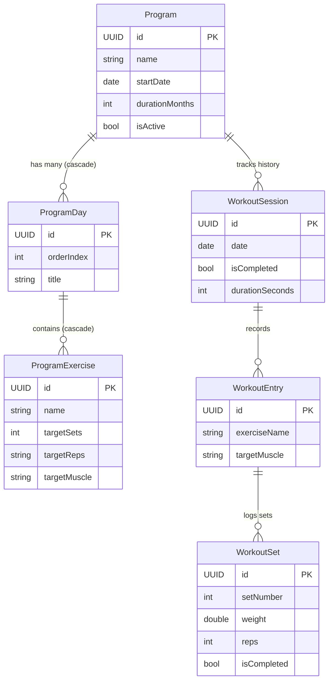

<div align="center">

# GymLog — Modern iOS Workout & Program Tracker

[](https://developer.apple.com/swift/)
[](https://developer.apple.com/ios/)
[](https://developer.apple.com/xcode/swiftui/)
[](https://developer.apple.com/documentation/swiftdata)
[](https://developer.apple.com/documentation/widgetkit)
[](LICENSE)

<p align="center">
  A high-performance, privacy-focused iOS workout logger and multi-split training engine built natively with <b>SwiftUI</b>, <b>SwiftData</b>, and <b>WidgetKit</b>.
</p>

</div>

---

## Table of Contents
- [Overview](#overview)
- [Key Features](#key-features)
- [System Architecture & Data Modeling](#system-architecture--data-modeling)
- [WidgetKit & Live Activities](#widgetkit--live-activities)
- [Design System & UI/UX](#design-system--uiux)
- [Tech Stack](#tech-stack)
- [Project Structure](#project-structure)
- [Getting Started](#getting-started)
- [Testing](#testing)
- [Author & License](#author--license)

---

## Overview

**GymLog** is an iOS application designed for athletes and lifters who demand precision, frictionless set logging, and dynamic workout program management. Built from the ground up utilizing Apple's modern Swift frameworks (iOS 17+), GymLog eliminates cloud lock-in and ad clutter by storing all workout histories locally with zero telemetry using **SwiftData**.

### Why GymLog?
-  **Zero-Latency In-Gym Logging:** Optimized stepper controls, quick rest timers, and instant weight/rep adjustments.
-  **Cyclic Program Progression:** Automatically rotates through Push/Pull/Legs, Upper/Lower, or custom split schedules based on completed sessions.
-  **Lock Screen & Widget Extensions:** Glanceable daily workout summaries and interactive controls directly from iOS Lock Screen and Home Screen.

---

## Key Features

### 1.  Dynamic Program Engine
- Create and manage multi-month training routines (`Program`, `ProgramDay`, `ProgramExercise`).
- Cyclic split calculation: dynamically computes the active day based on session completions (`completedCount % daysCount`).
- Supports exercise targets (sets, rep ranges, target RPE, and muscle group tagging).

### 2.  Live Workout Execution
- **Today's Workout Mode:** Automatically pulls up today's prescribed routine.
- Interactive set completion toggles with visual completion feedback.
- Real-time volume calculation and weight/unit conversions (KG / LBS).
- Quick exercise substitutions and ad-hoc set additions.

### 3.  Analytics & Progressive Overload
- Historical progression tracking across individual exercises.
- Total workout volume metrics and muscle distribution breakdown.
- Mini-analytics previews and session recap summaries.

### 4.  WidgetKit & App Group Sync
- Native Home Screen and Lock Screen widgets.
- Shared container architecture using App Groups (`SharedTypes`) ensuring instant synchronization between the host app and widget extensions.
- Interactive App Intents for rapid logging from outside the main app.

---

## System Architecture & Data Modeling

GymLog utilizes Apple's declarative **SwiftData** framework for ultra-fast, type-safe persistence with relational schema integrity.



---

## WidgetKit & Live Activities

GymLog integrates deeply with iOS system surfaces:
- **`GymLogWidget`**: Displays the active split day and next upcoming exercises.
- **`GymLogWidgetLiveActivity`**: Dynamic Island and Lock Screen live timer during active gym sessions.
- **`AppIntent`**: Background execution triggers allowing users to mark sets complete with a single tap.

---

## Design System & UI/UX

GymLog features a custom high-contrast design palette engineered for gym environments with low glare and high legibility:

| Element | Dark Mode (Default) | Light Mode | Hex Code |
| :--- | :--- | :--- | :--- |
| **Background** | Deep Sport Black-Blue | Cool Tint White | `#0B0F14` / `#F8FAFC` |
| **Cards & Surfaces** | Slate Surface | Soft Blue Surface | `#121A24` / `#E6F0FF` |
| **Energy Accent** | High-Visibility Neon Green | Bright Vibrant Green | `#30D158` / `#34C759` |
| **Action Accent** | Electric Apple Blue | Electric Apple Blue | `#0A84FF` / `#0A84FF` |
| **Typography** | Apple San Francisco Text | Apple San Francisco Text | System |

---

## Tech Stack

- **Language:** Swift 5.9+
- **Frameworks:** SwiftUI, SwiftData, WidgetKit, ActivityKit, AppIntents
- **Platform:** iOS 17.0+ / iPadOS 17.0+
- **Architecture:** Unidirectional Data Flow / MVVM + SwiftData ModelContext
- **Testing:** XCTest, Swift Testing, XCUITest

---

## Project Structure

```
GymLog/
 GymLog/                          # Main Application Target
    GymLogApp.swift              # App Entry Point & Schema Setup
    Models.swift                 # SwiftData Relational Models
    ProgramEngine.swift          # Progression & Split Computation Engine
    WorkoutService.swift         # Core Session Management
    Theme.swift                  # Color Palette & Design Tokens
    Utilities.swift              # Formatters & Helpers
    Units.swift                  # Metric/Imperial Conversion
    SeedData.swift               # Default Sample Splits & Workouts
    Views/
        ContentView.swift        # Root Navigation & TabBar
        TodayWorkoutView.swift   # Active Session Interface
        ProgramsView.swift       # Program Management List
        ProgramDetailView.swift  # Program Editor & Split Inspector
        DayDetailView.swift      # Split Day Detail
        ExerciseDetailView.swift # Exercise Configuration
        ExerciseStepperSheet.swift # Quick Value Adjuster
        AnalyticsView.swift      # Progression Charts & Stats
 GymLogWidget/                    # Widget Extension Target
    GymLogWidget.swift           # Home & Lock Screen Widgets
    GymLogWidgetLiveActivity.swift # Dynamic Island & Live Activity
    GymLogWidgetControl.swift    # iOS 18 Control Center Widgets
    AppIntent.swift              # Widget Interactive Intents
 Group/                           # App Group Shared Code
    SharedTypes.swift            # Cross-Target Data Contracts
 GymLogTests/                     # Unit Tests
    GymLogTests.swift
    ProgramEngineTests.swift     # Engine Validation Tests
 GymLogUITests/                   # UI End-to-End Automation Tests
```

---

## Getting Started

### Prerequisites
- macOS Sonoma (14.0+) or macOS Sequoia (15.0+)
- Xcode 15.0+ or Xcode 16.0+
- iOS 17.0+ Simulator or Physical Device

### Installation

1. **Clone the repository:**
   ```bash
   git clone https://github.com/a360n/GymLog.git
   cd GymLog
   ```

2. **Open in Xcode:**
   ```bash
   open GymLog.xcodeproj
   ```

3. **Configure Signing & App Groups:**
   - Select the `GymLog` target in Xcode.
   - Navigate to **Signing & Capabilities** and choose your Development Team.
   - Ensure the App Groups capability is active for both `GymLog` and `GymLogWidgetExtension`.

4. **Build & Run:**
   - Select an **iOS 17.0+** simulator or connected iPhone.
   - Press `Cmd + R` to compile and run.

---

## Testing

GymLog includes full test coverage for the deterministic program progression engine and UI flows:

```bash
# Run unit tests via xcodebuild CLI
xcodebuild test -project GymLog.xcodeproj -scheme GymLog -destination 'platform=iOS Simulator,name=iPhone 15 Pro'
```

---

## Author

**Ali Nasser (Ali Al-Khazali)**
-  Portfolio: [www.ali-nasser.dev](https://www.ali-nasser.dev)
-  GitHub: [@a360n](https://github.com/a360n)
-  LinkedIn: [Ali Nasser](https://linkedin.com/in/alinasser)

---

## License

This project is licensed under the MIT License — see the [LICENSE](LICENSE) file for details.